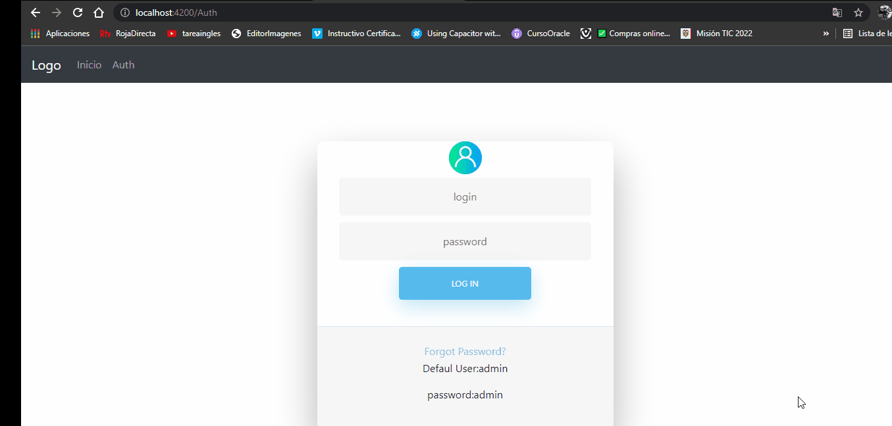

<h1 align="center">Bienvenido a Control de usuarios Roa 👋</h1>
<p>
 
  <a href="tarjet//dd" target="_blank">
    
  </a>
  
</p>

> Challenge Tecnico 



### 🏠 Descripción

Web Api que permite administrar Usuarios

* DotnetCore 3.1
* SqlServer Entity Framework core 5.0.7

FrontEnd Angular que permite interactuar con el Web Api y con el Usuario Final

* Angular CLI: 12.2.10
* Node: 12.18.4
* Package Manager: npm 6.14.6
* OS: win32 x64
* ng-bootstrap/ng-bootstrap 10
* bootstrap 4.5


## Configuración
 
Modificar el archivo appsettings.json
 
1. Cambiar los valores de la cadena de conexion a la base de datos oracle
 
 ```sh
	 "ConnectionStrings": {
    "myconn": "Server=eyz.xxxxxxx;Database=EZ;User Id=AdminV2;Password=abc123$$"
  }
```


3. correr el script "script base de datos .sql" ubicado en la carpeta documentacion


## Desplegar el web Api

para correr el web api , ejecutar las siguientes sentencias en una terminal.

```sh
    dotnet clean
    dotnet build
	dotnet run
```

## Desplegar el Front Angular

Para desplegar el proyecto front ejecutar las siguientes sentencia en una terminal ubicada en la raiz del proyecto

```sh
    npm install
	ng serve -o
```

## Rutas Web Api
El proyecto web api se despliega en localhost por el puerto 44336
y este cuenta con los siguientes endpoints:

Users
```sh
 Url Base https://localhost:44336/api/user
 
 * Post  
 * Put
 * Delete
 * Get
 * GetById
```

Auth
```sh
 Url Base https://localhost:44336/api/auth
 
 * Post  
 
```


nota: en la carpeta de documentacion se encuentra el archivo userCollection.postman_collection.json, que puede ser importado desde Postman para hacer las pruebas de los endpoints.


## Rutas Front End

El proyecto Angular se despliega en localhost por el puerto 4200


## Author

👤 **Roberto Ferney Contreras Roa**

* Website:  https://www.linkedin.com/in/roberto-contreras-76a3b017a/

* Github: [@RoaRoberto](https://github.com/roaroberto)
* LinkedIn: [@roberto-contreras-76a3b017a](https://www.linkedin.com/in/roberto-contreras-76a3b017a/)

### Show your support

Give a ⭐️ if this project helped you!

***
_This README was generated with ❤️ by [readme-md-generator](https://github.com/kefranabg/readme-md-generator)_
